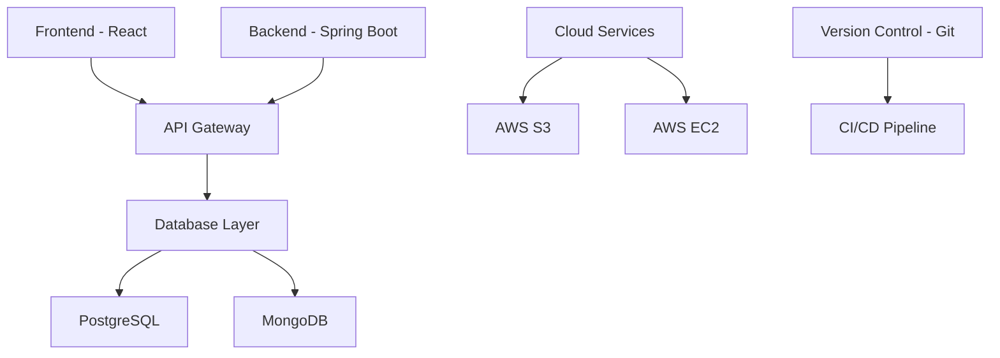

# I-Exam Portal

  Secure and Scalable Online Examination & Interview Platform

  Powered by RJAY Technologies

  
    Press Space for next page <carbon:arrow-right class="inline"/>
  

---
layout: default
---

# Project Overview

  A comprehensive web application designed for:

<v-clicks>

- Conducting secure online examinations
- Facilitating remote interviews
- Supporting multiple question formats
- Providing advanced assessment tools
- Ensuring scalability and performance
- Managing users and roles effectively

</v-clicks>

---
layout: two-cols
---

# Core Objectives

<v-clicks>

- Efficient & secure exam platform
- Versatile question management
- Enhanced user experience
- Comprehensive reporting
- Scalable architecture
- Real-time monitoring
- Multi-language support

</v-clicks>

::right::

 

---
layout: default
---

# Admin Module Features

### User Management
- Account creation and management
- Role-based access control
- Permission assignment
- User activity monitoring

### System Control
- Configuration management
- Security settings
- Notification system
- Audit logging

### Analytics
- Performance metrics
- Usage statistics
- Exam analytics
- Interview insights

### Communication
- Announcements
- Automated notifications
- Feedback management
- System updates

---
layout: default
---

# Staff Module Capabilities

### Exam Management
- Multiple question types
- Question bank
- Timer settings
- Randomization
- Auto-grading

### Interview Tools
- Scheduling system
- Question management
- Real-time assessment
- Candidate tracking

### Analytics & Reporting
- Performance analysis
- Result generation
- Statistical insights
- Export capabilities

### Monitoring
- Live exam supervision
- Proctoring features
- Student tracking
- Security measures

---
layout: default
---

# Student Module Features

### Core Features
- Personalized dashboard
- Exam scheduling
- Progress tracking
- Result viewing

### Practice Tools
- Mock examinations
- Interview preparation
- Sample questions
- Study resources

### Support Features
- Accessibility options
- Multi-language support
- Technical assistance
- Feedback system

### Security
- Secure browsing
- Anti-cheating measures
- Data protection
- Session management

---
layout: default
---

# Advanced Features

  

    

      

        <component :is="feature.icon" />
      

      <h3 :class="`text-2xl font-bold text-${feature.color}-600`">{{ feature.title }}</h3>
    

    <ul class="space-y-4">
      <li 
        v-for="item in feature.items" 
        class="flex items-center text-gray-700"
      >
        <carbon:checkmark-outline :class="`text-${feature.color}-500 mr-2`" />
        {{ item }}
      </li>
    </ul>
  

---
layout: default
---

# Technology Stack

---
layout: center
class: text-center
---

# Contact Us

  

    

      <h3 class="text-2xl font-bold mb-4">Get in Touch</h3>
      
📧 Email: dattudattakumar@gmail.com

      
📱 Phone: 93810504702

      
🌐 Website: www.iexams.live

    

    

      <h3 class="text-2xl font-bold mb-4">Follow Us</h3>
      
👥 LinkedIn: /iexamportal

      
🐦 Twitter: @iexamportal

      
📘 Facebook: /iexamportal

    

  

---
layout: center
class: text-center
---

# Thank You

  

    <h2 class="text-4xl font-bold bg-gradient-to-r from-blue-500 to-teal-500 bg-clip-text text-transparent">
      For more information about I-Exam Portal
    </h2>
    
A Product of RJAY Technologies

  

  
  

    <a 
      href="https://iexams.live" 
      target="_blank" 
      class="px-8 py-3 text-lg rounded-full bg-gradient-to-r from-blue-500 to-teal-500 text-white shadow-lg hover:shadow-xl transition-all duration-300 hover:scale-105 transform"
    >
      Get Started
    </a>
  

